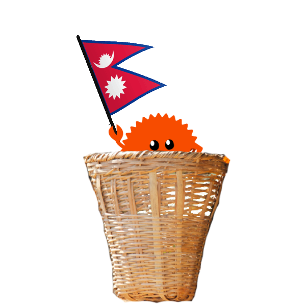

<div align="center">
    
    <h1>खिया<br>khiya<h1>
</div>

अङ्ग्रेजीमै Rust लेख्दा लेख्दै वाक्क भइसकेको हो? दिमागले नेपालीमै सोच्छ, तर हातले चाहिँ `fn`,
`let`, `return` टाइप गर्नुपर्छ? हो भने भेट्नुस् **खिया।** खियाले Rust लाई नेपाली बनाउँछ। 

यो मजाक मात्रै होइन, यो भाषिक पहुँचको सवाल हो। अंग्रेजी आउनुपर्छ भन्ने डर हटाऔं। नेपालीमा
सोच्ने मान्छेले कोड पनि नेपालीमै लेख्न पाइन्छ। हामीमध्ये कतिलाई अङ्ग्रेजीमा लेख्दा लेख्दा अङ्ग्रेजी
अलि धेरै आउने पनि हुन्छ, तिनीहरूले दुःख मान्नुपर्दैन। खिया, is fully compatible with
standard english-rust. so you can easily mix and match both in your projects.

here's an example of what can be achieved with khiya:

```rust
nepali! {
    sarbajanik prakriya udaran() {
        paribhasa x = 5;
        paribhasa y = 3;
        paribhasa uttar = x * y;
        chappankti!("{} guna {} = {}", x, y, uttar);
    }

    सार्वजनिक प्रक्रिया दोहोर्याउ() {
        परिभाषा परिवर्तनशील जम्मा = 0;
        परिभाषा परिवर्तनशील i = 1;
        जबसम्म i <= 5 {
            जम्मा = जम्मा + i;
            i = i + 1;
        }
        छापपङ्क्ति!("जम्मा: {}", जम्मा);
    }

    sarbajanik prakriya udaran_dui(sankhya: i32) -> i32 {
        sankhya * sankhya
    }
}

fn main() {
    udaran();
    दोहोर्याउ();

    let sankhya = 4;
    println!("{}", udaran_dui(sankhya));
}
```

## अरू भाषा | other languages

- french: [rouille](https://github.com/bnjbvr/rouille)
- dutch: [roest](https://github.com/jeroenhd/roest)
- german: [rost](https://github.com/michidk/rost)
- polish: [rdza](https://github.com/phaux/rdza)
- italian: [ruggine](https://github.com/DamianX/ruggine)
- russian: [Ржавый](https://github.com/Sanceilaks/rzhavchina)
- esperanto: [rustteksto](https://github.com/dscottboggs/rustteksto)
- toki pona: [jaki kiwen](https://github.com/jgcodes2020/jaki-kiwen)
- hindi: [zung](https://github.com/rishit-khandelwal/zung)
- hungarian: [rozsda](https://github.com/jozsefsallai/rozsda)
- chinese: [xiu (锈)](https://github.com/lucifer1004/xiu)
- spanish: [rustico](https://github.com/UltiRequiem/rustico)
- korean: [Nok (녹)](https://github.com/Alfex4936/nok)
- finnish: [ruoste](https://github.com/vkoskiv/ruoste)
- arabic: [sada](https://github.com/LAYGATOR/sada)
- turkish: [pas](https://github.com/ekimb/pas)
- vietnamese: [gỉ](https://github.com/Huy-Ngo/gir)
- japanese: [sabi (錆)](https://github.com/yuk1ty/sabi)
- danish: [rust?](https://github.com/LunaTheFoxgirl/rust-dk)
- marathi: [gan̄ja](https://github.com/pranavgade20/ganja)
- romanian: [rugină](https://github.com/aionescu/rugina)
- czech: [rez](https://github.com/radekvit/rez)
- ukrainian: [irzha](https://github.com/brokeyourbike/irzha)
- bulgarian: [ryzhda](https://github.com/gavadinov/ryzhda)
- slovak: [hrdza](https://github.com/TheMessik/hrdza)
- catalan: [rovell](https://github.com/gborobio73/rovell)
- corsican: [rughjina](https://github.com/aldebaranzbradaradjan/rughjina)
- indonesian: [karat](https://github.com/annurdien/karat)
- lithuanian: [rūdys](https://github.com/TruncatedDinosour/rudys)
- greek: [skouriasmeno](https://github.com/devlocalhost/skouriasmeno)
- thai: [sanim (สนิม)](https://github.com/korewaChino/sanim)
- swiss: [roeschti](https://github.com/Georg-code/roeschti)
- swedish: [rost](https://github.com/vojd/rost/)
- croatian: [hrđa](https://github.com/njelich/hrdja)
- persian: [zangar (زنگار)](https://github.com/ui-ce/zangar)
- malagasy: [arafesina](https://github.com/luckasRanarison/arafesina)
- latin: [ferrugo](https://github.com/pianoman911/ferrugo)
- norwegian: [korrosjon](https://github.com/datagutt/korrosjon)
- estonian: [rooste](https://github.com/hanshs/rooste)
- kannada [tukku (ತುಕ್ಕು)](https://github.com/sanathNU/tukku.git)
- sanskrit: [jangam](https://github.com/ishantanu/jangam.git)
- all of the above: [unirust](https://github.com/charyan/unirust)

## अनुमतिपत्र | License

[MIT](./LICENSE)
